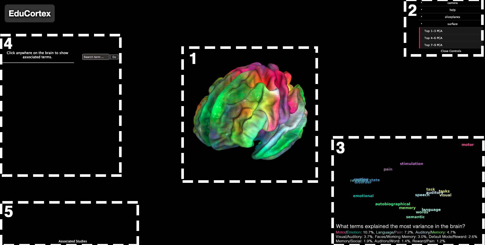

# Summary
[EduCortex](http://paulscotti.github.io/educortex) is an educational browser-based visualization tool that allows the user to enter any functional or anatomical term (e.g., "visual", "face", "motion", "precuneus") and visualize the parts of the brain that are most associated with that term. The process can also be reversed, where the user can click anywhere on the brain to see what terms are most associated with the selected brain region. Using principal components analysis, we also display the functional terms that explained the most variance across all activation maps. This tool works through the combination of Neurosynth [@neurosynth], a large-scale, automated database of fMRI papers, and PyCortex [@pycortex], an interactive 3D brain visualizer.

Below we detail the features of EduCortex in line with the steps displayed in the following figure.

 Figure 1. Image depicting what EduCortex initially looks like upon visiting the website. Dotted boxes and numbers are not displayed in the tool and are depicted here purely for the illustrative purpose of outlining EduCortex's features.

# Statement of Need
EduCortex is an educational tool that can be accessed through any web browser with an internet connection. We believe that this tool will be useful for instructional purposes. As an example, if a student wonders "what part of the brain processes words?", then they can search for "word" and see activation predominantly in the visual word form area located on the left fusiform gyrus [@mccandliss2003], in addition to more distributed areas of the brain. The reverse process of clicking a brain region to view the most associated terms allows the user to freely explore the brain to understand functional specialization. An improved anatomical understanding of the brain can also be gleaned by rotating, inflating, and flattening the brain in addition to the anatomical label overlay provided in the viewer. The principal components analysis maps illustrate the large-scale functional specialization of the brain by depicting the terms that explained the most variance across NeuroSynth activation maps. 

# Features
## 1. Interactive 3D Brain
The brain used for all visualization is the "fsaverage" brain taken from Freesurfer [@freesurfer]. The brain can be rotated by clicking and dragging with the mouse. It can also be resized by right-clicking and dragging with the mouse. The initial activation map displayed on the brain is a colormap representing the top 3 principal components of our dimensionality reduction procedure (see Principal Components Analysis section). 

## 2. Viewer Controls
All the default viewer controls implemented in PyCortex are available in EduCortex. Using this control panel, the brain can be rotated, resized, inflated, flattened, etc. Clicking the "shortcuts" panel underneath "help" reveals useful keyboard shortcuts to these features.

### PCA Dialog
The "Top ... PCA" buttons, once clicked, will reveal the colormap and associated wordcloud for the top-ranked principal components across non-anatomical activation maps.

### Anatomical Labels
By going to "surface" > "overlays" > "rois" and clicking the "visible" radio button and the "labels" radio button, an overlay will be displayed that depicts the [multi-modal Human Connectome Project parcellation map](https://figshare.com/articles/HCP-MMP1_0_projected_on_fsaverage/3498446/2) from @glasser2016 with abbreviated labels.

## 3. Principal Component Analysis (PCA)
What psychological terms can best explain the variability in brain activity observed across fMRI studies? We used PCA to reduce the dimensionality of the Neurosynth database to answer this question. We took the 1,334 terms considered by Neurosynth to "carry psychological or anatomical content" and further reduced this number to 950 terms by eliminating all anatomical terms. With this set of 950 activation maps (1 map per term, each map containing 228,453 whole-brain voxels), we performed PCA to observe the components that best explained the variance across all activation maps. In other words, this procedure reduced the 950 maps of 228,453 voxels to only 9 maps of 228,453 voxels (9 maps = number of components used for PCA). By coloring each of the top three components a different color (red, green, or blue), we can overlay this 3D representation onto the brain as if it were an activation map, and it is this map that is first loaded when visiting the webpage. The user can also visualize individual component maps on the brain by typing the term "pca1" (for the top component, "pca2" for the second top component, and so on) into the search box.

### Variance Explained
The variance explained for each of the top 9 components is depicted below the wordcloud. We also examined the principal component scores for each term to see what terms were weighted most heavily (positively or negatively) for the top components. These top weighted terms are depicted below the wordcloud according to each term's associated component. For example, the top component's most positively weighted term was "Motor" and the top component's most negatively weighted term was "Emotion". This same ordering is applied to the other components, where the term to the left of the "/" sign refers to the top positively weighted term for the associated component, and the term to the right of the "/" sign refers to the top negatively weighted term.

### Wordcloud
To create the wordcloud displayed at the bottom right of the webpage, we first drew a convex hull (smallest convex polygon that contains all points) around the top three principal component scores across terms. Because the principal components are uncorrelated with each other, the vertices of this convex hull represented the terms with the heaviest weights associated with one of the components. By performing PCA on the vertices of this convex hull (each vertex being a term), we can reduce this 3D representation into a 2D representation and then color the vertices of the convex hull according to the most associated components (red, green, blue). This results in the wordcloud plot shown in the bottom right of the viewer. The user can use the viewer controls at the top right of the webpage to alternate between wordcloud plots of the top 3 components, the 4th - 6th top components, and the 7th - 9th top components. 

## 4. Associated Terms
The user can type any term into the search bar and press Enter (or click the Go button) to overlay the term's activation map on the brain. The user can also click anywhere on the brain to pull up the terms associated with that brain region (reporting studies within 6mm of the clicked brain location) from Neurosynth. These displayed terms can then be clicked on to overlay that term's activation map. Beside each term we also display the term's z-score for the clicked voxel. This z-score is obtained from Neurosynth and represents the "association test" meta-analysis map for the corresponding term. Neurosynth states that "the association test maps tell you whether activation in a region occurs more consistently for studies that mention the current term than for studies that don't. So for instance, the fact that the amygdala shows a large positive z-score in the association test map for emotion implies that studies whose abstracts include the word 'emotion' are more likely to report amygdala activation than studies whose abstracts don't include the word 'emotion'."

## 5. Associated Studies
Along with the associated terms for a clicked region, we also display up to 10 of the studies that were used to provide the displayed meta-analysis map. These studies are pulled from Neurosynth and are sorted in order of the number of reported activations in the paper that were within 6mm of the clicked brain location.

# Acknowledgments
EduCortex was created as part of [Neurohackademy 2019](https://neurohackademy.org/). We thank the organizers, instructors, and participants of Neurohackademy for their helpful discussion and insight.

# License
This project is licensed under the GNU General Public License v2.0 - see the LICENSE.md file for details.

# References
